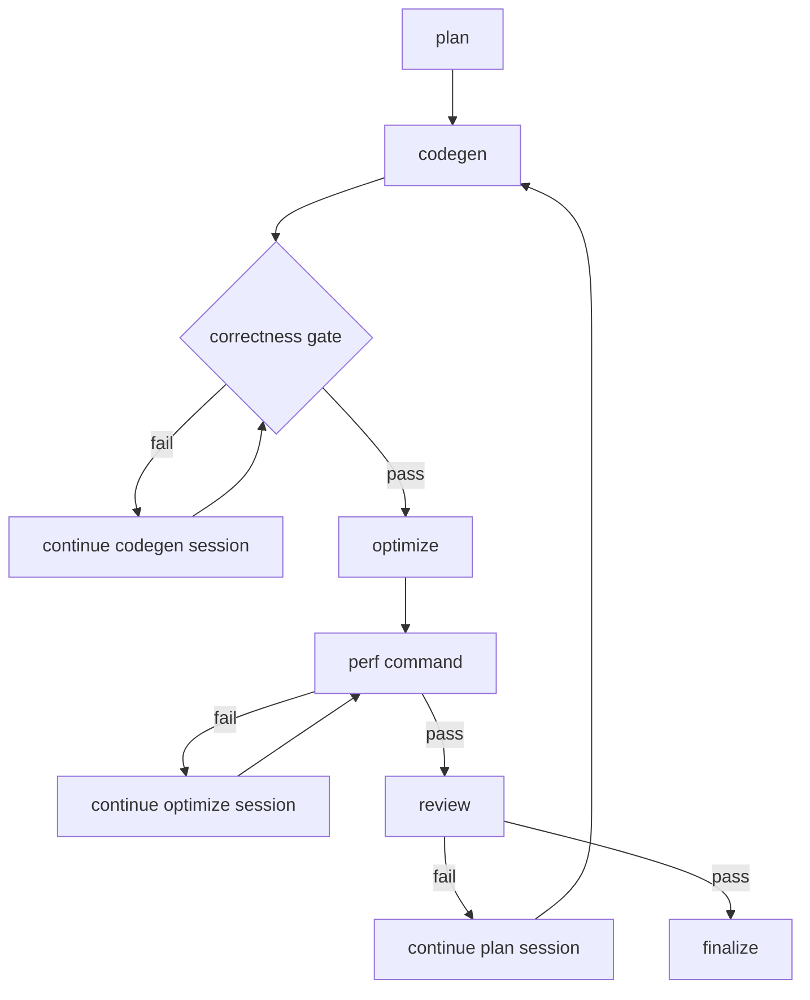

# operator-dsl-loop

Framework-first loop workflow for generating optimized DSL operators from compact user intent and a PyTorch reference implementation path.

This packaged workflow intentionally keeps correctness and performance checks fake. The goal is to provide a reusable workflow shape that downstream repositories can replace with real checker scripts without redesigning the loop contracts.

## Flow



## What This Prototype Already Covers

This example is prototype-complete at the framework layer. It already defines:

- the graph shape for planning, generation, external correctness gating, optimization, external performance gating, review, and finalization
- persistent sessions for the four agent roles: `plan`, `codegen`, `optimize`, and `review`
- runner feedback nodes that inject failed gate output back into the same agent session
- agent-stage prompt roles and expected outputs
- machine-readable gate outputs, even though the gate logic is fake
- example handoff and review artifacts that show what a runner must preserve
- rule artifacts that should be injected during plan, codegen, and review

Prototype-complete here means a production repository should be able to keep the same workflow shape and contracts while swapping in real adapters.

## Files

- `workflow.yml`: graph workflow definition
- `prompts/`: prompt templates for agent nodes
- `checks/`: fake gate/finalize command templates proving routing behavior
- `artifacts/`: sample run input, handoff, gate, and review artifacts
- `generated/`: sample stage output proving the expected codegen surface
- `reference/`: sample PyTorch reference implementation consumed by the prototype input
- `rules/`: sample rule artifacts for planning and review

## Prototype Startup

From the repository root, run:

```bash
bun run prototype:operator
```

This command uses the placeholder runner. It logs agent session boundaries, executes fake correctness/perf/finalize commands, and writes runtime output under `.runs/operator-dsl-loop`. Production environments should replace the placeholder runner with real agent session orchestration.

## Production Replacement Surfaces

Downstream repositories should preserve the graph and artifact contracts, but replace these adapters:

- `checks/fake-correctness.ts` -> real PyTorch-reference correctness command
- `checks/fake-perf.ts` -> real benchmark or profiler wrapper
- `checks/fake-finalize.ts` -> real publish, register, or export step
- `artifacts/input.json` -> real run input shape produced by the runtime entrypoint
- `rules/` -> repository-specific domain rules, review rules, and guardrails

The production repository must also add the parts this kit deliberately omits:

- runner code that assembles prompts from `handoff-manifest.json`
- runner support for persistent agent sessions and `agent_feedback` continuation nodes
- runner support for review decisions such as `pass_contains: "合格"`
- artifact persistence for prompt, stdout, stderr, result, and selected artifacts
- debug entrypoints for replaying a single stage or a single gate
- environment bootstrap for the reference implementation, datasets, and toolchain
- logging and metrics that make failed loops diagnosable

## Migration Order

1. Copy the workflow, prompt, rule, and artifact templates into the target repository.
2. Replace the fake correctness, perf, and finalize commands with real scripts.
3. Keep the handoff and review artifact contracts stable while wiring the real runner.
4. Add replay and debug commands before running the full loop.
5. Only then tune repository-specific thresholds, datasets, and deployment hooks.
