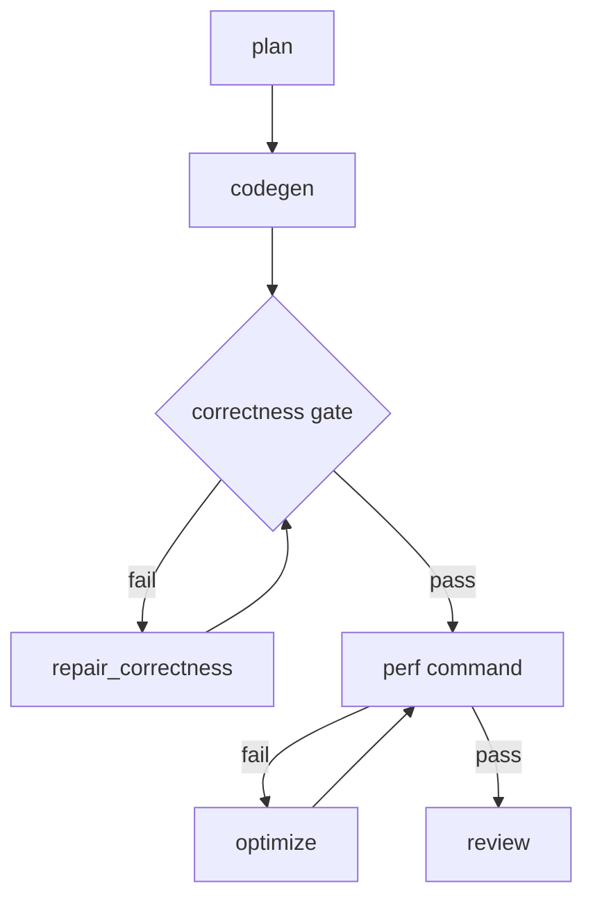

# operator-dsl-loop

Framework-first loop workflow for generating optimized DSL operators from compact user intent and a PyTorch reference implementation path.

This packaged workflow intentionally keeps correctness and performance checks fake. The goal is to provide a reusable workflow shape that downstream repositories can replace with real checker scripts.

## Flow

## Files

- `workflow.yml`: graph workflow definition
- `prompts/`: prompt templates for agent nodes
- `checks/`: fake gate command templates proving routing behavior

## Intended Replacement Points

- Replace `checks/fake-correctness.ts` with the target repository's PyTorch-reference correctness checker.
- Replace `checks/fake-perf.ts` with the target repository's benchmark/profiler wrapper.
- Add rule artifacts such as `rules/operator-review.md` and inject them through the workflow runner's prompt assembly layer.
