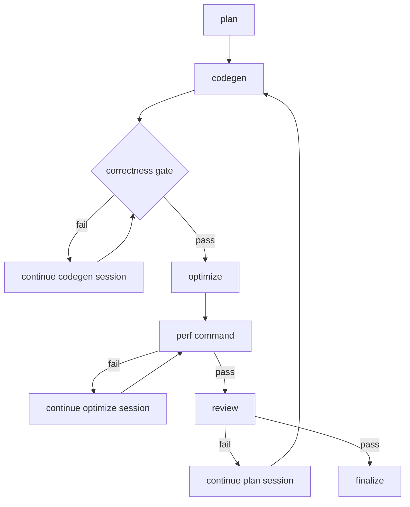

# operator-dsl-loop

Framework-first loop workflow for generating optimized DSL operators from compact user intent and a PyTorch reference implementation path.

This packaged workflow intentionally keeps correctness and performance checks fake. The goal is to provide a reusable workflow shape and a session-capable prototype runtime that downstream repositories can adapt by replacing environment-specific adapters without redesigning the loop contracts.

## Flow



## What This Prototype Already Covers

This example is prototype-complete at the framework layer. It already defines:

- the graph shape for planning, generation, external correctness gating, optimization, external performance gating, review, and finalization
- persistent sessions for the four agent roles: `plan`, `codegen`, `optimize`, and `review`
- runner feedback nodes that inject failed gate output back into the same agent session
- agent-stage prompt roles and expected outputs
- machine-readable gate outputs, even though the gate logic is fake
- a handoff manifest the runner actually consumes for deterministic prompt assembly
- example handoff and review artifacts that show what a runner must preserve
- fake persistent sessions, prompt persistence, and replay/debug entrypoints
- rule artifacts that should be injected during plan, codegen, and review

Prototype-complete here means a production repository should be able to keep the same workflow shape and contracts while swapping in real adapters.

Review routing is driven by the structured field `decision.approved === true`. The text signal `合格` remains in the example review artifact for human readability and backward-compatible prototype checks, but it is not the canonical machine-routing field.

## Files

- `workflow.yml`: graph workflow definition
- `prompts/`: prompt templates for agent nodes
- `checks/`: fake gate/finalize command templates proving routing behavior
- `artifacts/`: sample run input, handoff, gate, and review artifacts
- `generated/`: sample stage output proving the expected codegen surface
- `reference/`: sample PyTorch reference implementation consumed by the prototype input
- `rules/`: sample rule artifacts for planning and review

## Prototype Startup

From the repository root, run:

```bash
bun run prototype:run -- --workflow workflows/operator-dsl-loop/workflow.yml
```

This command uses the session-capable prototype runner. It derives a canonical run directory from the sample input run id, creates or resumes fake persistent sessions, assembles prompts from `handoff-manifest.json`, executes fake correctness/perf/finalize commands, and writes runtime output under `.runs/operator-dsl-loop/<runId>`.

On startup, the runner also prints the concrete inspect/sessions/debug-guide commands for that run directory and writes the full set of replay commands to:

```text
<run-dir>/artifacts/prototype-debug-commands.txt
```

It also emits a decoupled monitor snapshot contract:

```text
<run-dir>/artifacts/workflow-monitor.snapshot.json
<run-dir>/artifacts/workflow-monitor.events.jsonl
```

The repo-local TypeScript monitor package can render that run directory without importing prototype runner code:

```bash
cd workflow-monitor
bun install
bun run build
bun run start
```

Optional: point it at another runs root and highlight one run:

```bash
bun run start -- --runs-root /abs/path/to/.runs --default-run /abs/path/to/.runs/operator-dsl-loop/<runId>
```

Additional debug entrypoints:

```bash
bun run prototype:replay -- --workflow workflows/operator-dsl-loop/workflow.yml --mode inspect --run-dir .runs/operator-dsl-loop/layer-norm-operator-dsl
bun run prototype:replay -- --workflow workflows/operator-dsl-loop/workflow.yml --mode sessions --run-dir .runs/operator-dsl-loop/layer-norm-operator-dsl
bun run prototype:replay -- --workflow workflows/operator-dsl-loop/workflow.yml --mode stage --run-dir .runs/operator-dsl-loop/layer-norm-operator-dsl --stage codegen
bun run prototype:replay -- --workflow workflows/operator-dsl-loop/workflow.yml --mode gate --run-dir .runs/operator-dsl-loop/layer-norm-operator-dsl --gate correctness
```

## Production Replacement Surfaces

Downstream repositories should preserve the graph and artifact contracts, but replace these adapters:

- `checks/fake-correctness.ts` -> real PyTorch-reference correctness command
- `checks/fake-perf.ts` -> real benchmark or profiler wrapper
- `checks/fake-finalize.ts` -> real publish, register, or export step
- `artifacts/input.json` -> real run input shape produced by the runtime entrypoint
- `rules/` -> repository-specific domain rules, review rules, and guardrails

The production repository must still add the parts this kit deliberately omits:

- environment bootstrap for the reference implementation, datasets, and toolchain
- logging and metrics that make failed loops diagnosable
- real engine adapters for OpenCode / Codex / HTTP session APIs
- real correctness, perf, and finalize commands

## Migration Order

1. Copy the workflow, prompt, rule, and artifact templates into the target repository.
2. Replace the fake correctness, perf, and finalize commands with real scripts.
3. Replace the fake session adapter with the target repository's real agent-session adapter.
4. Keep the handoff and review artifact contracts stable while wiring environment-specific paths and sandboxes.
5. Only then tune repository-specific thresholds, datasets, and deployment hooks.
